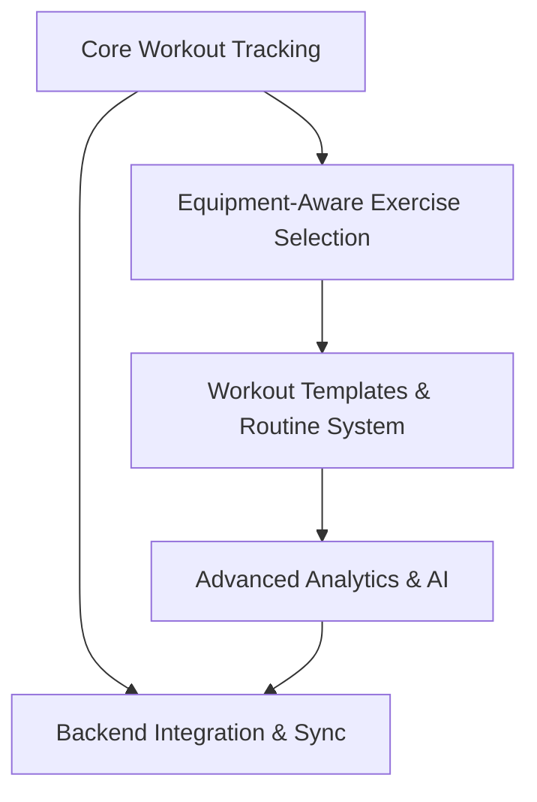

# Project Roadmap: FitForge V2 Systematic

**Last Updated**: 2025-06-25 (Equipment phase complete - Workout builder with real-time muscle visualization)

## 1. Overall Project Vision & Goals
* Create sophisticated personal workout tracker with muscle fatigue analytics and progressive overload targeting
* Implement comprehensive UI flow analysis system based on Fitbod patterns
* Build scalable architecture supporting AI-powered workout generation and analytics

## 2. Major Project Phases / Epics

### Phase/Epic: Core Workout Tracking
* **Description**: Fundamental workout logging with exercise selection and set tracking
* **Status**: Completed (Current Implementation)
* **Key Objectives**:
  * Working MVP with dashboard and exercise selection
  * localStorage-based workout persistence
  * Basic muscle engagement analytics
* **Primary HDTA Links**: 
  * components_module.md - UI implementation
  * data_module.md - Exercise database and storage
* **Notes/Key Deliverables for this Phase/Epic**:
  * FitbodHome component with muscle group selection
  * WorkoutLoggerEnhanced with set logging
  * Dashboard analytics with volume tracking

### Phase/Epic: Equipment-Aware Exercise Selection
* **Description**: Implement equipment filtering based on available gym equipment
* **Status**: Completed (Advanced features implemented)
* **Key Objectives**:
  * Equipment toggle interface matching Fitbod patterns ✅
  * Real-time exercise filtering by equipment availability ✅
  * User preference persistence for equipment settings ✅
  * Workout builder with real-time muscle volume visualization ✅
* **Primary HDTA Links**: 
  * implementation_plan_equipment_filtering.md
  * flows_module.md - Reference patterns from Mobbin analysis
* **Notes/Key Deliverables for this Phase/Epic**:
  * Equipment filter UI component with portal-based z-index solution ✅
  * Enhanced exercise selection with filtering logic ✅
  * Integration with existing muscle group workflows ✅
  * Two-column workout builder with live muscle loading visualization ✅
  * Real-time muscle volume calculations with debounced performance ✅

### Phase/Epic: Workout Templates & Routine System
* **Description**: Replace muscle group cards with pre-built workout templates
* **Status**: Planned
* **Key Objectives**:
  * Push/Pull/Legs routine templates
  * A/B workout variations for periodization
  * Template customization based on available equipment
* **Primary HDTA Links**: 
  * implementation_plan_workout_templates.md (to be created)
  * flows_module.md - Routine selection patterns
* **Notes/Key Deliverables for this Phase/Epic**:
  * Workout template data structures
  * Template selection interface
  * A/B variation system implementation

### Phase/Epic: Advanced Analytics & AI
* **Description**: Enhanced muscle fatigue tracking and AI-powered workout generation
* **Status**: Initial Planning
* **Key Objectives**:
  * 5-day muscle recovery model implementation
  * Progressive overload optimization algorithms
  * AI workout generation based on equipment and fatigue state
* **Primary HDTA Links**: 
  * ai_analytics_module.md
  * implementation_plan_ai_enhancement.md (to be created)
* **Notes/Key Deliverables for this Phase/Epic**:
  * Advanced fatigue calculation algorithms
  * Intelligent workout suggestions
  * Progressive overload tracking and recommendations

### Phase/Epic: Backend Integration & Sync
* **Description**: Full backend API integration with real-time sync capabilities
* **Status**: Partially Completed (Backend exists, integration pending)
* **Key Objectives**:
  * Replace localStorage with backend persistence
  * Real-time workout sync across devices
  * Enhanced analytics with server-side processing
* **Primary HDTA Links**: 
  * backend_module.md
  * implementation_plan_api_integration.md (to be created)
* **Notes/Key Deliverables for this Phase/Epic**:
  * Frontend-backend API integration
  * Data migration from localStorage to backend
  * Enhanced error handling and offline support

## 3. High-Level Inter-Phase/Epic Dependencies

## 4. Key Project-Wide Milestones
* **Equipment Filtering Complete**: Functional equipment-based exercise selection - Status: ✅ Complete
* **Workout Builder MVP**: Real-time muscle volume visualization with sophisticated planning - Status: ✅ Complete
* **Template System Launch**: Full workout template implementation with A/B variations - Status: Next Priority
* **AI Analytics MVP**: Working muscle fatigue and progressive overload system - Status: Planned
* **Backend Integration**: Complete transition from localStorage to backend APIs - Status: Planned
* **Portfolio Ready**: Production-quality fitness app demonstrating advanced algorithms - Status: In Progress

## 5. Overall Project Notes / Strategic Considerations
* Flow analysis system provides comprehensive UI pattern library for consistent implementation
* Memory-bank structure enables systematic development approach with clear documentation
* Equipment filtering serves as foundation for all subsequent template and AI features
* Progressive complexity allows for portfolio demonstration at multiple development stages